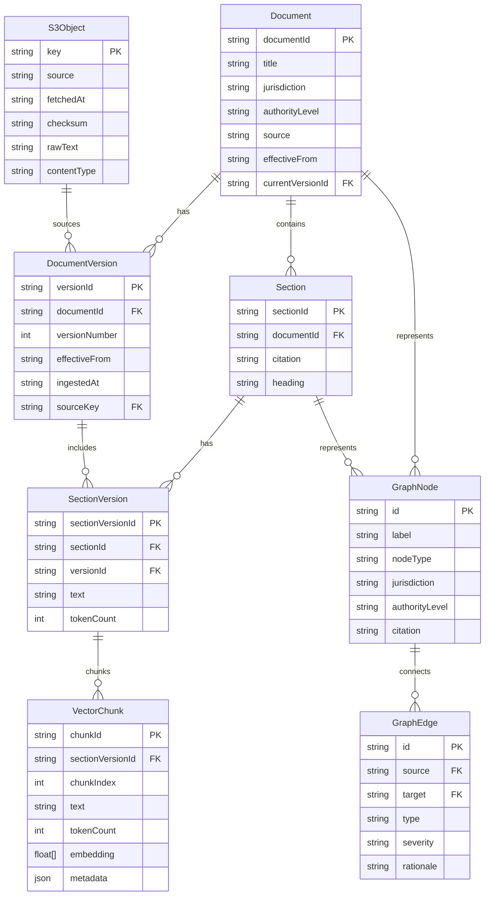

# feat: Pre-Production Ingestion Pipeline Dashboard

## Overview

Add an **Ingest** capability to the Vulcan Legal Platform that demonstrates a 4-stage data ingestion pipeline with simulated storage layers (S3 → Postgres → Vector DB → Knowledge Graph). This feature showcases the architecture of a production legal RAG system for interviewer demonstrations.

## Problem Statement / Motivation

The current demo is frontend-only with static mock data. To demonstrate understanding of production data pipelines, we need:

1. **Visual pipeline execution** - Show real-time progress through ingestion stages
2. **Layered storage architecture** - Demonstrate understanding of S3, relational DB, vector DB, and graph storage
3. **Output exploration** - Allow users to inspect what each layer contains
4. **Graph visualization** - Connect ingested data to the existing React Flow graph view

This makes the demo **interview-ready** by showing:
- Data engineering fundamentals (ETL pipelines)
- Vector search architecture (chunking, embeddings)
- Knowledge graph construction (legal authority relationships)

## Technical Approach

### Architecture

```
┌─────────────────────────────────────────────────────────────────────┐
│                         /ingest Route                                │
├─────────────────────────────────────────────────────────────────────┤
│  ┌─────────────┐  ┌─────────────────────┐  ┌───────────────────┐   │
│  │   Source    │  │   Pipeline Stepper  │  │   Outputs Tabs    │   │
│  │  Selector   │  │                     │  │                   │   │
│  │             │  │  ┌─────┐ ┌─────┐   │  │  ┌─────┐ ┌─────┐  │   │
│  │  [Dropdown] │  │  │ S3  │→│ PG  │   │  │  │ S3  │ │Meta │  │   │
│  │             │  │  └─────┘ └─────┘   │  │  └─────┘ └─────┘  │   │
│  │  [Start]    │  │     ↓       ↓      │  │  ┌─────┐ ┌─────┐  │   │
│  │             │  │  ┌─────┐ ┌─────┐   │  │  │Vect.│ │Graph│  │   │
│  │             │  │  │Vect │→│Graph│   │  │  └─────┘ └─────┘  │   │
│  └─────────────┘  │  └─────┘ └─────┘   │  │                   │   │
│                   └─────────────────────┘  └───────────────────┘   │
└─────────────────────────────────────────────────────────────────────┘
                                │
                                ▼
┌─────────────────────────────────────────────────────────────────────┐
│                      Zustand Store (Persisted)                       │
├─────────────────────────────────────────────────────────────────────┤
│  {                                                                   │
│    currentCorpus: 'us-code' | 'ecfr' | 'texas' | 'austin' | null,  │
│    stages: [{ id, status, progress, startedAt, completedAt }],      │
│    outputs: {                                                        │
│      s3Objects: S3Object[],                                         │
│      documents: Document[],                                          │
│      sections: Section[],                                            │
│      chunks: VectorChunk[],                                          │
│      graphNodes: GraphNode[],                                        │
│      graphEdges: GraphEdge[]                                         │
│    }                                                                 │
│  }                                                                   │
└─────────────────────────────────────────────────────────────────────┘
```

### Data Flow

```mermaid
flowchart LR
    subgraph Stage A [Stage A: Raw Capture]
        A1[Load mock corpus] --> A2[Create S3Object items]
        A2 --> A3[Store in Zustand]
    end

    subgraph Stage B [Stage B: Parse + Metadata]
        B1[Parse rawText] --> B2[Create Documents]
        B2 --> B3[Create Sections]
        B3 --> B4[Create Versions]
    end

    subgraph Stage C [Stage C: Chunk + Embed]
        C1[Chunk SectionVersions] --> C2[Token-based splitting]
        C2 --> C3[Generate fake embeddings]
        C3 --> C4[Create VectorChunks]
    end

    subgraph Stage D [Stage D: Build Graph]
        D1[Create GraphNodes] --> D2[Create authority edges]
        D2 --> D3[Create conflict edges]
        D3 --> D4[Layout with dagre]
    end

    Stage A --> Stage B --> Stage C --> Stage D
```

### Entity Relationship Diagram



## Implementation Phases

### Phase 1: Foundation (Types, Store, Navigation)

**Files to create/modify:**

1. **`src/lib/ingestion/types.ts`** - Type definitions
   ```typescript
   export type CorpusSource = 'us-code' | 'ecfr' | 'texas-statutes' | 'austin-ordinances';
   export type StageStatus = 'pending' | 'in_progress' | 'completed' | 'error';
   export type Jurisdiction = 'federal' | 'state' | 'municipal';
   export type AuthorityLevel = 'constitution' | 'statute' | 'regulation' | 'ordinance';

   export interface PipelineStage {
     id: 's3' | 'postgres' | 'vector' | 'graph';
     label: string;
     description: string;
     status: StageStatus;
     progress: number; // 0-100
     outputCount: number;
     startedAt?: string;
     completedAt?: string;
     error?: string;
   }

   export interface S3Object { /* as specified */ }
   export interface Document { /* as specified */ }
   export interface DocumentVersion { /* as specified */ }
   export interface Section { /* as specified */ }
   export interface SectionVersion { /* as specified */ }
   export interface VectorChunk { /* as specified */ }
   export interface GraphNode { /* as specified */ }
   export interface GraphEdge { /* as specified */ }
   ```

2. **`src/lib/ingestion/store.ts`** - Zustand store with persistence
   ```typescript
   import { create } from 'zustand';
   import { persist } from 'zustand/middleware';

   interface IngestionState {
     currentCorpus: CorpusSource | null;
     stages: PipelineStage[];
     isRunning: boolean;
     outputs: {
       s3Objects: S3Object[];
       documents: Document[];
       documentVersions: DocumentVersion[];
       sections: Section[];
       sectionVersions: SectionVersion[];
       chunks: VectorChunk[];
       graphNodes: GraphNode[];
       graphEdges: GraphEdge[];
     };
     // Actions
     setCorpus: (corpus: CorpusSource) => void;
     startPipeline: () => Promise<void>;
     updateStage: (stageId: string, updates: Partial<PipelineStage>) => void;
     setOutputs: (outputs: Partial<IngestionState['outputs']>) => void;
     reset: () => void;
   }
   ```

3. **`src/components/layout/header.tsx`** - Add Ingest nav item
   ```typescript
   import { Upload } from 'lucide-react';
   // Add to navLinks:
   { href: '/ingest', label: 'Ingest', icon: Upload }
   ```

4. **Install Zustand:**
   ```bash
   npm install zustand
   ```

5. **Install additional shadcn/ui components:**
   ```bash
   npx shadcn@latest add tabs table progress select
   ```

### Phase 2: Mock Data & Pipeline Logic

**Files to create:**

1. **`src/lib/ingestion/datasets.ts`** - Built-in mock legal texts
   ```typescript
   export const CORPUS_DATASETS: Record<CorpusSource, RawDocument[]> = {
     'us-code': [
       {
         id: 'usc-42-3604',
         title: 'Fair Housing Act - Discrimination in Sale or Rental',
         citation: '42 U.S.C. § 3604',
         jurisdiction: 'federal',
         authorityLevel: 'statute',
         rawText: `It shall be unlawful—
           (a) To refuse to sell or rent after the making of a bona fide offer...
           (b) To discriminate against any person in the terms, conditions...`,
         effectiveFrom: '1968-04-11',
       },
       // 3-4 more federal statutes
     ],
     'ecfr': [
       // Federal regulations
     ],
     'texas-statutes': [
       // State laws
     ],
     'austin-ordinances': [
       // Municipal ordinances
     ],
   };
   ```

2. **`src/lib/ingestion/pipeline.ts`** - Pipeline execution logic
   ```typescript
   export async function runStageA(
     corpus: CorpusSource,
     onProgress: (progress: number) => void
   ): Promise<S3Object[]> {
     const dataset = CORPUS_DATASETS[corpus];
     const s3Objects: S3Object[] = [];

     for (let i = 0; i < dataset.length; i++) {
       await delay(300); // Simulate network
       s3Objects.push({
         key: `${corpus}/${dataset[i].id}/release_${Date.now()}.json`,
         source: corpus,
         fetchedAt: new Date().toISOString(),
         checksum: generateChecksum(dataset[i].rawText),
         rawText: dataset[i].rawText,
         contentType: 'application/json',
       });
       onProgress(((i + 1) / dataset.length) * 100);
     }

     return s3Objects;
   }

   export async function runStageB(s3Objects: S3Object[], onProgress): Promise<...>
   export async function runStageC(sectionVersions: SectionVersion[], onProgress): Promise<...>
   export async function runStageD(documents: Document[], sections: Section[], onProgress): Promise<...>
   ```

3. **`src/lib/ingestion/chunking.ts`** - Token-based text chunking
   ```typescript
   export interface ChunkConfig {
     targetTokens: number;      // 200-500
     minTokens: number;         // 120
     maxTokens: number;         // 800
     overlapTokens: number;     // 10-20%
   }

   export function chunkText(text: string, config: ChunkConfig): TextChunk[]
   export function estimateTokenCount(text: string): number
   ```

4. **`src/lib/ingestion/embeddings.ts`** - Fake embedding generation
   ```typescript
   export function generateFakeEmbedding(text: string, dimensions = 384): number[] {
     // Hash-seeded PRNG for deterministic results
     const seed = hashString(text);
     const rng = seedRandom(seed);
     return Array(dimensions).fill(0).map(() => rng() * 2 - 1);
   }
   ```

### Phase 3: UI Components

**Files to create:**

1. **`src/app/ingest/page.tsx`** - Route page (Server Component)
   ```typescript
   import { Metadata } from 'next';
   import { IngestDashboard } from '@/components/ingest/ingest-dashboard';

   export const metadata: Metadata = {
     title: 'Ingest | Vulcan Legal',
     description: 'Ingest legal documents into the analysis pipeline.',
   };

   export default function IngestPage() {
     return <IngestDashboard />;
   }
   ```

2. **`src/components/ingest/ingest-dashboard.tsx`** - Main dashboard layout
   - 3-panel layout: Source selector | Pipeline stepper | Outputs tabs
   - Uses Zustand store for state
   - Responsive design with Tailwind

3. **`src/components/ingest/source-selector.tsx`** - Corpus dropdown + Start button
   - Select component with 4 corpus options
   - Start Ingestion button (disabled during active pipeline)
   - Optional: "Simulate Errors" toggle

4. **`src/components/ingest/pipeline-stepper.tsx`** - 4-stage vertical stepper
   - Stage icons: HardDrive, Database, Cpu, Network
   - Status indicators: pending (gray), in_progress (blue+spinner), completed (green+check), error (red+x)
   - Progress bar per stage
   - Output counts (e.g., "5 docs, 23 sections, 89 chunks")

5. **`src/components/ingest/outputs-tabs.tsx`** - Tabbed output viewer
   - 4 tabs: S3 Objects | Metadata | Vector Index | Graph Summary
   - Progressive reveal (tabs enabled as stages complete)

### Phase 4: Output Tab Components

**Files to create:**

1. **`src/components/ingest/tabs/s3-objects-tab.tsx`**
   - Table: key, source, fetchedAt, contentType, checksum
   - Click row → Dialog showing rawText preview
   - Uses shadcn/ui Table + Dialog

2. **`src/components/ingest/tabs/metadata-tab.tsx`**
   - Sub-tabs: Documents | Versions | Sections | SectionVersions
   - Data tables with key fields
   - Click row → Detail sheet

3. **`src/components/ingest/tabs/vector-index-tab.tsx`**
   - Table: chunkId, citation, tokenCount, jurisdiction, authorityLevel
   - Click row → Shows chunk text + metadata
   - Info callout: "Metadata filtering enables hybrid search"

4. **`src/components/ingest/tabs/graph-summary-tab.tsx`**
   - Stats cards: Node count, Edge count, by jurisdiction
   - Mini React Flow preview (200px height)
   - "Open Full Graph View" button → navigates to /graph

### Phase 5: Integration & Polish

**Files to modify:**

1. **`src/app/graph/page.tsx`** - Use ingested graph data
   - Check if ingestion store has data
   - If yes, use `outputs.graphNodes` and `outputs.graphEdges`
   - If no, fall back to static mock data

2. **`src/hooks/use-graph.ts`** - Add ingestion data integration
   ```typescript
   import { useIngestionStore } from '@/lib/ingestion/store';

   export function useGraph() {
     const ingestionOutputs = useIngestionStore((s) => s.outputs);
     const hasIngestionData = ingestionOutputs.graphNodes.length > 0;

     // Return ingested data if available, else mock data
   }
   ```

3. **`src/components/graph/legal-graph.tsx`** - Handle ingested nodes/edges
   - Accept optional `nodes` and `edges` props
   - Style conflict edges with red dashed lines

4. **Optional: `src/app/chat/page.tsx`** - Use ingested citations
   - If ingestion data exists, use real citations from ingested sections

## Acceptance Criteria

### Functional Requirements

- [ ] User can navigate to `/ingest` via header navigation
- [ ] User can select from 4 corpus sources in dropdown
- [ ] User can click "Start Ingestion" to begin pipeline
- [ ] Pipeline shows 4 stages with real-time progress (0-100%)
- [ ] Each stage displays status: pending → in_progress → completed
- [ ] Each stage shows output counts upon completion
- [ ] S3 Objects tab shows table of raw files with click-to-preview
- [ ] Metadata tab shows Documents, Versions, Sections, SectionVersions tables
- [ ] Vector Index tab shows chunks with token counts and metadata
- [ ] Graph Summary tab shows node/edge counts and mini preview
- [ ] "Open Full Graph View" navigates to `/graph` with ingested data
- [ ] State persists across page navigation (Zustand + localStorage)
- [ ] Re-ingesting same corpus overwrites previous data (with confirmation)

### Non-Functional Requirements

- [ ] Pipeline completes in 6-10 seconds total (simulated delays)
- [ ] UI remains responsive during pipeline execution
- [ ] Design matches existing dark theme and design system
- [ ] All TypeScript types are properly defined (no `any`)
- [ ] No console errors or warnings

### Quality Gates

- [ ] `npm run build` succeeds without errors
- [ ] `npm run lint` passes
- [ ] All new components use existing design tokens from globals.css
- [ ] Stepper, tables, and tabs use shadcn/ui components

## File Structure Summary

```
src/
├── app/
│   └── ingest/
│       └── page.tsx                          # NEW
├── components/
│   ├── ingest/                               # NEW directory
│   │   ├── ingest-dashboard.tsx
│   │   ├── source-selector.tsx
│   │   ├── pipeline-stepper.tsx
│   │   ├── outputs-tabs.tsx
│   │   └── tabs/
│   │       ├── s3-objects-tab.tsx
│   │       ├── metadata-tab.tsx
│   │       ├── vector-index-tab.tsx
│   │       └── graph-summary-tab.tsx
│   ├── layout/
│   │   └── header.tsx                        # MODIFY (add nav item)
│   └── ui/
│       ├── tabs.tsx                          # ADD via shadcn
│       ├── table.tsx                         # ADD via shadcn
│       ├── progress.tsx                      # ADD via shadcn
│       └── select.tsx                        # ADD via shadcn
├── lib/
│   ├── ingestion/                            # NEW directory
│   │   ├── types.ts
│   │   ├── store.ts
│   │   ├── datasets.ts
│   │   ├── pipeline.ts
│   │   ├── chunking.ts
│   │   └── embeddings.ts
│   └── types.ts                              # EXTEND with shared types
└── hooks/
    └── use-graph.ts                          # MODIFY (integration)
```

## Dependencies & Prerequisites

**New npm packages:**
- `zustand` - State management with persistence

**New shadcn/ui components:**
- `tabs` - Output viewer tabs
- `table` - Data display
- `progress` - Stage progress bars
- `select` - Corpus dropdown

**Existing dependencies (already installed):**
- `@xyflow/react` - Graph visualization
- `@dagrejs/dagre` - Graph layout
- `lucide-react` - Icons

## Risk Analysis & Mitigation

| Risk | Likelihood | Impact | Mitigation |
|------|------------|--------|------------|
| Zustand hydration mismatch | Medium | Medium | Use `skipHydration` option, handle in useEffect |
| Large embedding arrays slow localStorage | Low | Medium | Limit stored embeddings to 100, summarize rest |
| React Flow SSR issues | Low | High | Dynamic import with `ssr: false` |
| Pipeline state corruption on refresh | Medium | Medium | Store stage checkpoints, allow resume |

## Success Metrics

1. **Demo Effectiveness**: Interviewer understands 4-layer architecture within 30 seconds
2. **Visual Clarity**: Each stage purpose is immediately obvious from UI
3. **Data Realism**: Mock data looks like real legal documents
4. **Performance**: Pipeline runs smoothly without UI jank

## References

### Internal References
- Navigation pattern: `src/components/layout/header.tsx:15-25`
- Graph visualization: `src/components/graph/legal-graph.tsx`
- Type definitions: `src/lib/types.ts`
- Mock data pattern: `src/lib/mock-data.ts`
- Design tokens: `src/app/globals.css:1-50`

### External References
- [Zustand Persist Middleware](https://github.com/pmndrs/zustand/blob/main/docs/middlewares/persist.md)
- [React Flow Custom Nodes](https://reactflow.dev/docs/examples/nodes/custom-node/)
- [shadcn/ui Data Table](https://ui.shadcn.com/docs/components/data-table)
- [Pinecone Chunking Strategies](https://www.pinecone.io/learn/chunking-strategies/)

### Related Work
- Current mock data: `src/lib/mock-data.ts`
- Existing graph page: `src/app/graph/page.tsx`
