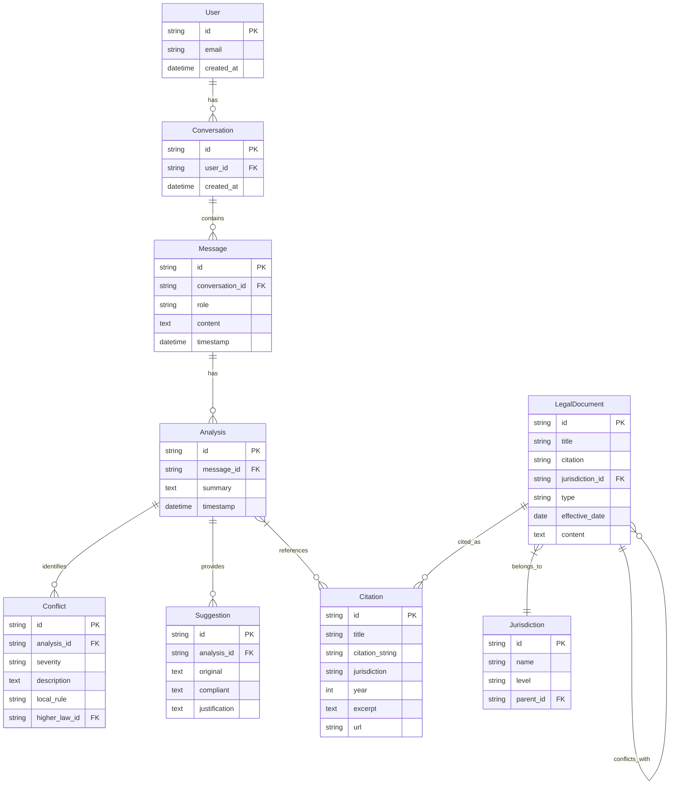

# Mini Legal-Reasoning Platform - Implementation Plan

**Created:** 2025-01-01
**Status:** Ready for Review
**Type:** New Feature - Frontend Implementation
**Priority:** High

---

## Overview

Build a Next.js-based legal reasoning platform that analyzes local rules and draft bills for conflicts with higher-level laws (Federal > State > Municipal). This phase focuses on **frontend implementation only** — landing page, chat interface, and graph visualization. Backend AI/RAG integration will be implemented in a subsequent phase.

---

## Problem Statement

Legal professionals and policy makers need to:
1. Quickly identify if a local ordinance conflicts with state or federal law
2. Understand the legal reasoning behind conflicts with proper citations
3. Get suggestions for compliant alternative language
4. Visualize the legal hierarchy to understand authority relationships

Currently, this requires expensive legal research services or deep domain expertise. This platform democratizes access to conflict analysis.

---

## Proposed Solution

A three-view Next.js application:

| View | Purpose | Key Components |
|------|---------|----------------|
| **Landing Page** | Marketing & conversion | Hero, features, CTA, trust signals |
| **Chat Interface** | Legal analysis interaction | Query input, response display, citations, reasoning chain |
| **Graph Visualization** | Legal hierarchy exploration | Interactive node graph, detail panels, filters |

---

## Technical Approach

### Tech Stack (Defined)

```
Framework:      Next.js 14+ (App Router)
Language:       TypeScript (strict mode)
Styling:        Tailwind CSS with custom theme
Components:     shadcn/ui
Graph:          React Flow (@xyflow/react)
Icons:          Lucide React
State:          React hooks (useState, useReducer)
```

### Design System (From Design Inspiration Files)

**Brand Colors:**
| Token | Value | Usage |
|-------|-------|-------|
| `brand-primary` | `#38BDF8` | Primary accent, CTAs, links |
| `brand-primary-alpha` | `#0EA5E94D` | Hover states |

**Background Colors (Dark Theme):**
| Token | Value | Usage |
|-------|-------|-------|
| `bg-primary` | `#0A1322` | Main background |
| `bg-secondary` | `#000000` | Alternative background |
| `bg-elevated` | `#0F172A` | Cards, elevated surfaces |
| `bg-card` | `#020617` | Card backgrounds |

**Text Colors:**
| Token | Value | Usage |
|-------|-------|-------|
| `text-primary` | `#FFFFFF` | Primary text |
| `text-secondary` | `#CBD5E1` | Secondary text |
| `text-muted` | `#94A3B8` | Muted/tertiary text |

**Border Colors:**
| Token | Value | Usage |
|-------|-------|-------|
| `border-dark` | `#FFFFFF1A` | Dark mode borders |
| `border-dark-strong` | `#FFFFFF33` | Emphasized borders |

**Status Colors:**
| Token | Value | Usage |
|-------|-------|-------|
| `status-success` | `#6EE7B7` | Success states |
| `status-warning` | `#FCD34D` | Warning states |
| `status-error` | `#FCA5A5` | Error states |
| `accent-purple` | `#D8B4FE` | Graph/highlights |

---

## Architecture

### File Structure

```
src/
├── app/
│   ├── layout.tsx              # Root layout with providers
│   ├── page.tsx                # Landing page (/)
│   ├── globals.css             # Tailwind + custom theme
│   ├── chat/
│   │   ├── page.tsx            # Chat interface (/chat)
│   │   └── loading.tsx         # Streaming fallback
│   ├── graph/
│   │   └── page.tsx            # Graph visualization (/graph)
│   └── api/
│       └── analyze/
│           └── route.ts        # Mock API endpoint
├── components/
│   ├── ui/                     # shadcn/ui components
│   │   ├── button.tsx
│   │   ├── card.tsx
│   │   ├── input.tsx
│   │   ├── scroll-area.tsx
│   │   └── ...
│   ├── layout/
│   │   ├── header.tsx          # Persistent navigation header
│   │   ├── footer.tsx          # Landing page footer
│   │   └── sidebar.tsx         # App sidebar (chat/graph)
│   ├── landing/
│   │   ├── hero.tsx            # Hero section
│   │   ├── features.tsx        # Feature highlights
│   │   ├── demo-preview.tsx    # Interactive demo preview
│   │   └── cta-section.tsx     # Final call-to-action
│   ├── chat/
│   │   ├── chat-container.tsx  # Main chat wrapper
│   │   ├── message-list.tsx    # Message display area
│   │   ├── message-item.tsx    # Individual message
│   │   ├── chat-input.tsx      # Query input form
│   │   ├── reasoning-chain.tsx # Step-by-step reasoning
│   │   ├── conflict-card.tsx   # Conflict display
│   │   └── suggestion-card.tsx # Compliant language suggestion
│   ├── citation/
│   │   ├── citation-badge.tsx  # Inline citation reference
│   │   ├── citation-panel.tsx  # Expanded citation detail
│   │   └── citation-list.tsx   # List of citations
│   └── graph/
│       ├── legal-graph.tsx     # Main graph component
│       ├── legal-node.tsx      # Custom node component
│       ├── node-detail-panel.tsx # Node detail sidebar
│       └── graph-controls.tsx  # Zoom, layout controls
├── lib/
│   ├── utils.ts                # cn() and utilities
│   ├── mock-data.ts            # Mock responses and graph data
│   └── types.ts                # TypeScript interfaces
├── hooks/
│   ├── use-chat.ts             # Chat state management
│   └── use-graph.ts            # Graph state management
└── styles/
    └── graph.css               # React Flow custom styles
```

### Type Definitions

```typescript
// lib/types.ts

export type JurisdictionLevel = 'federal' | 'state' | 'municipal';
export type ConflictSeverity = 'high' | 'medium' | 'low';
export type MessageRole = 'user' | 'assistant';

export interface Citation {
  id: string;
  title: string;
  citation: string;           // "42 U.S.C. § 1983"
  jurisdiction: JurisdictionLevel;
  year: number;
  excerpt?: string;
  url?: string;
}

export interface Conflict {
  id: string;
  severity: ConflictSeverity;
  description: string;
  localRule: string;
  higherLaw: Citation;
  conflictType: 'direct' | 'preemption' | 'implicit';
}

export interface ReasoningStep {
  step: number;
  description: string;
  citations: Citation[];
  confidence?: number;
}

export interface Suggestion {
  id: string;
  original: string;
  compliant: string;
  justification: string;
}

export interface AnalysisResponse {
  id: string;
  query: string;
  summary: string;
  conflicts: Conflict[];
  reasoningChain: ReasoningStep[];
  suggestions: Suggestion[];
  citations: Citation[];
  timestamp: Date;
}

export interface Message {
  id: string;
  role: MessageRole;
  content: string;
  analysis?: AnalysisResponse;
  timestamp: Date;
}

export interface LegalNode {
  id: string;
  title: string;
  citation: string;
  jurisdiction: JurisdictionLevel;
  type: 'constitution' | 'statute' | 'regulation' | 'ordinance';
  status: 'active' | 'conflicting' | 'superseded';
  effectiveDate?: string;
}

export interface LegalEdge {
  id: string;
  source: string;
  target: string;
  relationship: 'authorizes' | 'conflicts' | 'amends' | 'derives';
}
```

---

## Implementation Phases

### Phase 1: Project Setup & Design System

**Tasks:**
- [ ] Initialize Next.js project with TypeScript and Tailwind
- [ ] Configure Tailwind with custom color tokens from design files
- [ ] Install and configure shadcn/ui
- [ ] Set up project structure (folders, base files)
- [ ] Create CLAUDE.md with project conventions
- [ ] Create type definitions (lib/types.ts)

**Files to create:**
```
package.json
tsconfig.json
tailwind.config.ts
next.config.ts
src/app/layout.tsx
src/app/globals.css
src/lib/utils.ts
src/lib/types.ts
CLAUDE.md
```

**Acceptance Criteria:**
- [ ] `npm run dev` starts successfully
- [ ] Custom colors available in Tailwind
- [ ] TypeScript strict mode enabled
- [ ] shadcn/ui Button component works

---

### Phase 2: Landing Page

**Tasks:**
- [ ] Create Header component with navigation
- [ ] Create Hero section with headline, subheadline, CTA
- [ ] Create Features section (3 feature cards)
- [ ] Create Demo Preview section (static screenshot/animation)
- [ ] Create CTA section with primary button
- [ ] Create Footer with links
- [ ] Implement responsive design (mobile-first)
- [ ] Add basic animations (fade-in, hover states)

**Files to create:**
```
src/app/page.tsx
src/components/layout/header.tsx
src/components/layout/footer.tsx
src/components/landing/hero.tsx
src/components/landing/features.tsx
src/components/landing/demo-preview.tsx
src/components/landing/cta-section.tsx
```

**Acceptance Criteria:**
- [ ] Landing page renders at /
- [ ] Navigation links to /chat and /graph
- [ ] Responsive on mobile, tablet, desktop
- [ ] "Get Started" CTA navigates to /chat
- [ ] All text is readable (contrast meets WCAG AA)

---

### Phase 3: Chat Interface (UI Only)

**Tasks:**
- [ ] Create Chat layout with sidebar
- [ ] Create Message list component with scroll
- [ ] Create User message component
- [ ] Create Assistant message component with structured sections
- [ ] Create Chat input with submit button
- [ ] Create mock data for sample responses
- [ ] Implement ReasoningChain component
- [ ] Implement ConflictCard component
- [ ] Implement SuggestionCard component
- [ ] Create CitationBadge (inline) component
- [ ] Create CitationPanel (expanded) component
- [ ] Add loading states (skeleton messages)
- [ ] Add empty state (no messages yet)

**Files to create:**
```
src/app/chat/page.tsx
src/app/chat/loading.tsx
src/components/chat/chat-container.tsx
src/components/chat/message-list.tsx
src/components/chat/message-item.tsx
src/components/chat/chat-input.tsx
src/components/chat/reasoning-chain.tsx
src/components/chat/conflict-card.tsx
src/components/chat/suggestion-card.tsx
src/components/citation/citation-badge.tsx
src/components/citation/citation-panel.tsx
src/components/citation/citation-list.tsx
src/hooks/use-chat.ts
src/lib/mock-data.ts
```

**Acceptance Criteria:**
- [ ] Chat page renders at /chat
- [ ] User can type and submit queries
- [ ] Mock response appears after short delay
- [ ] Reasoning chain shows numbered steps
- [ ] Conflicts display with severity indicators
- [ ] Citations are clickable and expand
- [ ] Suggestions show original vs. compliant text
- [ ] Chat scrolls to latest message
- [ ] Loading skeleton appears during "processing"

---

### Phase 4: Graph Visualization

**Tasks:**
- [ ] Install and configure React Flow
- [ ] Create mock legal hierarchy data (Federal → State → Municipal)
- [ ] Create custom LegalNode component
- [ ] Implement hierarchical layout with dagre
- [ ] Create NodeDetailPanel sidebar
- [ ] Add zoom, pan, and fit controls
- [ ] Implement node click to show detail
- [ ] Style nodes by jurisdiction level
- [ ] Add conflict indicators on nodes
- [ ] Add graph legend
- [ ] Implement responsive behavior (disable complex features on mobile)

**Files to create:**
```
src/app/graph/page.tsx
src/components/graph/legal-graph.tsx
src/components/graph/legal-node.tsx
src/components/graph/node-detail-panel.tsx
src/components/graph/graph-controls.tsx
src/components/graph/graph-legend.tsx
src/hooks/use-graph.ts
src/styles/graph.css
```

**Acceptance Criteria:**
- [ ] Graph page renders at /graph
- [ ] Legal hierarchy displays with proper levels
- [ ] Nodes are color-coded by jurisdiction
- [ ] Clicking node opens detail panel
- [ ] Users can zoom and pan
- [ ] "Fit to view" button works
- [ ] Graph is readable on tablet+ (mobile shows warning)

---

### Phase 5: Polish & Integration

**Tasks:**
- [ ] Add navigation between views (header links, breadcrumbs)
- [ ] Implement "View in Graph" from chat citations
- [ ] Add keyboard shortcuts (Escape to close panels)
- [ ] Implement dark mode toggle (future light mode prep)
- [ ] Add focus states for accessibility
- [ ] Add aria-labels and screen reader support
- [ ] Test all user flows
- [ ] Fix responsive issues
- [ ] Optimize bundle size
- [ ] Add error boundaries

**Files to modify:**
```
src/components/layout/header.tsx (add mode toggle)
src/components/chat/citation-badge.tsx (add graph link)
src/app/layout.tsx (add ThemeProvider)
```

**Acceptance Criteria:**
- [ ] All navigation flows work smoothly
- [ ] Keyboard navigation works for all interactive elements
- [ ] No console errors
- [ ] Lighthouse score > 90
- [ ] All empty/error states handled

---

## Alternatives Considered

### Graph Library Options

| Option | Pros | Cons | Decision |
|--------|------|------|----------|
| **React Flow** | Best React integration, great docs, TypeScript | Slightly heavier bundle | **Selected** |
| D3.js | Most flexible, smallest bundle | Steeper learning curve, less React-native | Rejected |
| Vis.js | Good for large graphs | Older API, less React-friendly | Rejected |
| Sigma.js | Great performance | Less hierarchical layout support | Rejected |

### Mock Data Strategy

| Option | Pros | Cons | Decision |
|--------|------|------|----------|
| **Static fixtures** | Simple, predictable, fast | Less realistic testing | **Selected for Phase 1** |
| Mock API endpoint | Closer to production | More setup, not needed yet | Future phase |
| Dynamic generation | Varied testing | Over-engineering for frontend | Rejected |

---

## Acceptance Criteria

### Functional Requirements

- [ ] Landing page explains platform value proposition
- [ ] Users can navigate between landing, chat, and graph views
- [ ] Chat interface accepts text queries
- [ ] Chat displays mock responses with citations, reasoning, suggestions
- [ ] Citations are expandable with detail view
- [ ] Graph shows legal hierarchy with interactive nodes
- [ ] Node detail panel shows law information
- [ ] All views are responsive (mobile, tablet, desktop)

### Non-Functional Requirements

- [ ] Page load under 2 seconds
- [ ] Lighthouse performance score > 90
- [ ] WCAG 2.1 AA color contrast
- [ ] Keyboard navigable
- [ ] Works in Chrome, Firefox, Safari, Edge

### Quality Gates

- [ ] TypeScript strict mode passes
- [ ] No ESLint errors
- [ ] All components have proper TypeScript types
- [ ] Manual testing of all user flows documented

---

## Dependencies & Prerequisites

### External Dependencies
```json
{
  "next": "^14.0.0",
  "react": "^18.0.0",
  "typescript": "^5.0.0",
  "@xyflow/react": "^12.0.0",
  "@dagrejs/dagre": "^1.1.0",
  "tailwindcss": "^3.4.0",
  "lucide-react": "^0.400.0",
  "class-variance-authority": "^0.7.0",
  "clsx": "^2.1.0",
  "tailwind-merge": "^2.2.0"
}
```

### shadcn/ui Components Needed
```bash
npx shadcn@latest add button card input scroll-area dialog
npx shadcn@latest add tooltip badge separator avatar
```

### Prerequisites
- [ ] Node.js 18+ installed
- [ ] Design files reviewed (design inspiration folder)
- [ ] Git repository initialized

---

## Risk Analysis & Mitigation

| Risk | Probability | Impact | Mitigation |
|------|-------------|--------|------------|
| React Flow performance on large graphs | Medium | High | Limit node count, add virtualization warning |
| Design system color contrast issues | Low | Medium | Test with accessibility tools early |
| Mock data structure mismatch with future API | Medium | Medium | Define TypeScript types upfront, document contracts |
| Mobile graph experience poor | High | Medium | Show simplified view or "desktop recommended" on mobile |
| Scope creep into backend features | Medium | High | Strict phase boundaries, defer AI/RAG to Phase 2 |

---

## Future Considerations

### Phase 2: Backend Integration
- Connect to AI model (Claude/GPT-4) for real analysis
- Implement RAG with legal document corpus
- Add streaming responses

### Phase 3: Data Layer
- PostgreSQL for metadata
- pgvector for embeddings
- Neo4j or Postgres graph for relationships

### Phase 4: Advanced Features
- User authentication
- Saved queries and history
- Export to PDF
- Citation format preferences
- Team collaboration

---

## References & Research

### Internal References
- Design System: `design inspiration/` folder contains color definitions
- Color Tokens: Extracted from `brand-colors-*.json`, `background-colors-*.json`, etc.

### External References
- [Next.js App Router Documentation](https://nextjs.org/docs/app)
- [React Flow Documentation](https://reactflow.dev)
- [shadcn/ui Components](https://ui.shadcn.com)
- [Tailwind CSS v3](https://tailwindcss.com/docs)
- [WCAG 2.1 Guidelines](https://www.w3.org/WAI/WCAG21/quickref/)

### Design Inspiration
- [Shape of AI - UX Patterns](https://www.shapeof.ai/) - AI interface patterns
- [Casetext](https://casetext.com/) - Legal research UI reference
- [Westlaw/LexisNexis](https://www.westlaw.com/) - Citation display patterns

---

## ERD Diagram (Future Data Model)



---

## Appendix: Mock Data Examples

### Sample Chat Response

```typescript
const mockAnalysis: AnalysisResponse = {
  id: "analysis-001",
  query: "Does Austin's short-term rental ordinance conflict with Texas state law?",
  summary: "The Austin ordinance restricting short-term rentals to owner-occupied properties may conflict with Texas Property Code provisions on private property rights.",
  conflicts: [
    {
      id: "conflict-001",
      severity: "medium",
      description: "Austin's owner-occupancy requirement limits property rights beyond state-permitted restrictions",
      localRule: "Austin Code § 25-2-788: Short-term rental registration requires owner to reside on property",
      higherLaw: {
        id: "cit-001",
        title: "Texas Property Code",
        citation: "Tex. Prop. Code § 5.001",
        jurisdiction: "state",
        year: 2023,
        excerpt: "Property owners have the right to use property in any lawful manner..."
      },
      conflictType: "implicit"
    }
  ],
  reasoningChain: [
    {
      step: 1,
      description: "Identified the local ordinance: Austin Code § 25-2-788 governing short-term rentals",
      citations: [],
      confidence: 0.95
    },
    {
      step: 2,
      description: "Searched Texas Property Code for state-level property rights provisions",
      citations: [{ id: "cit-001", /* ... */ }],
      confidence: 0.9
    },
    {
      step: 3,
      description: "Analyzed whether owner-occupancy requirement exceeds municipal authority",
      citations: [],
      confidence: 0.75
    }
  ],
  suggestions: [
    {
      id: "sug-001",
      original: "Short-term rental registration requires owner to reside on property",
      compliant: "Short-term rental registration may include optional owner-occupancy incentives",
      justification: "Optional incentives preserve property rights while encouraging owner oversight"
    }
  ],
  citations: [/* ... */],
  timestamp: new Date()
};
```

### Sample Graph Data

```typescript
const mockGraphNodes: LegalNode[] = [
  {
    id: "us-const",
    title: "U.S. Constitution",
    citation: "U.S. Const.",
    jurisdiction: "federal",
    type: "constitution",
    status: "active"
  },
  {
    id: "42-usc-1983",
    title: "Civil Rights Act",
    citation: "42 U.S.C. § 1983",
    jurisdiction: "federal",
    type: "statute",
    status: "active"
  },
  {
    id: "tex-prop-code",
    title: "Texas Property Code",
    citation: "Tex. Prop. Code § 5.001",
    jurisdiction: "state",
    type: "statute",
    status: "active"
  },
  {
    id: "austin-str",
    title: "Austin STR Ordinance",
    citation: "Austin Code § 25-2-788",
    jurisdiction: "municipal",
    type: "ordinance",
    status: "conflicting"
  }
];

const mockGraphEdges: LegalEdge[] = [
  { id: "e1", source: "us-const", target: "42-usc-1983", relationship: "authorizes" },
  { id: "e2", source: "us-const", target: "tex-prop-code", relationship: "authorizes" },
  { id: "e3", source: "tex-prop-code", target: "austin-str", relationship: "authorizes" },
  { id: "e4", source: "austin-str", target: "tex-prop-code", relationship: "conflicts" }
];
```

---

**Plan Version:** 1.0
**Last Updated:** 2025-01-01
